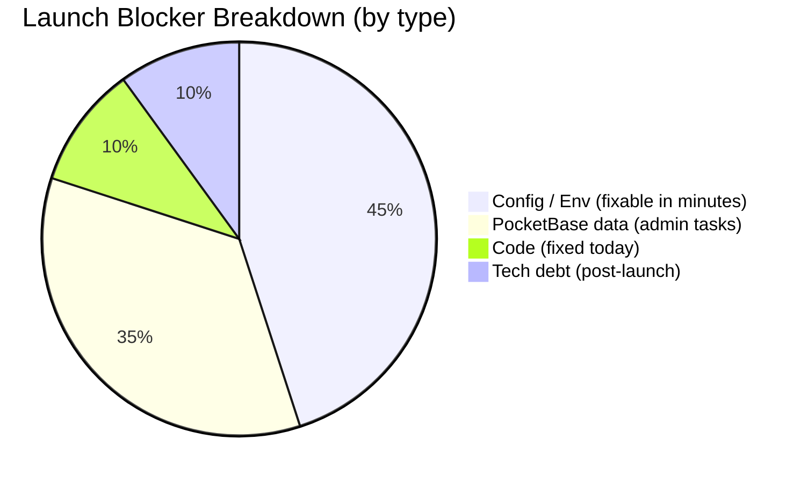
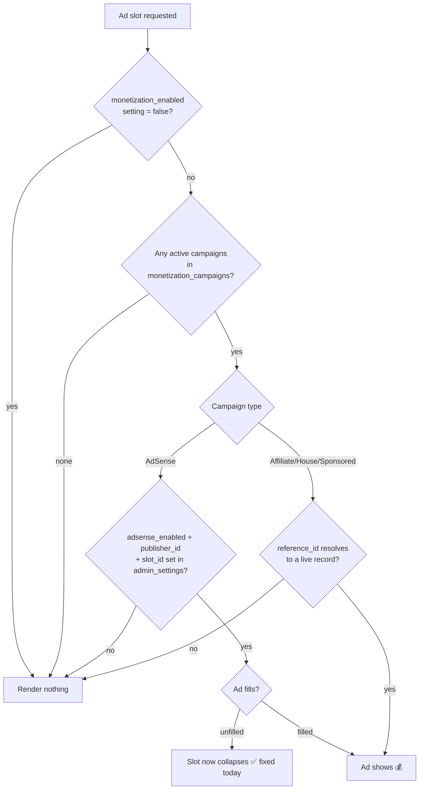
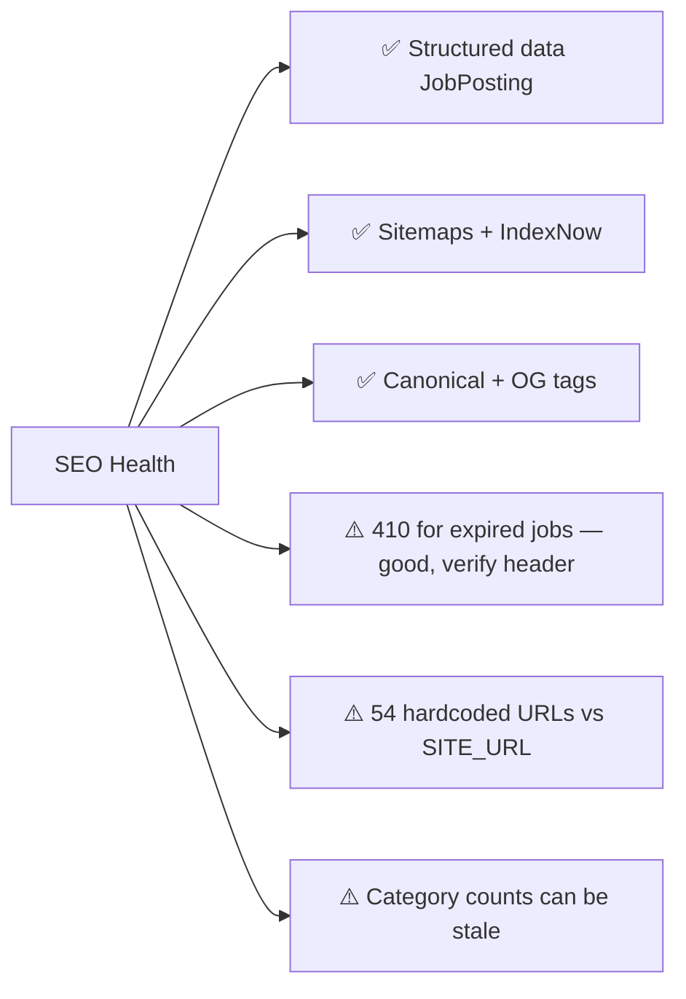
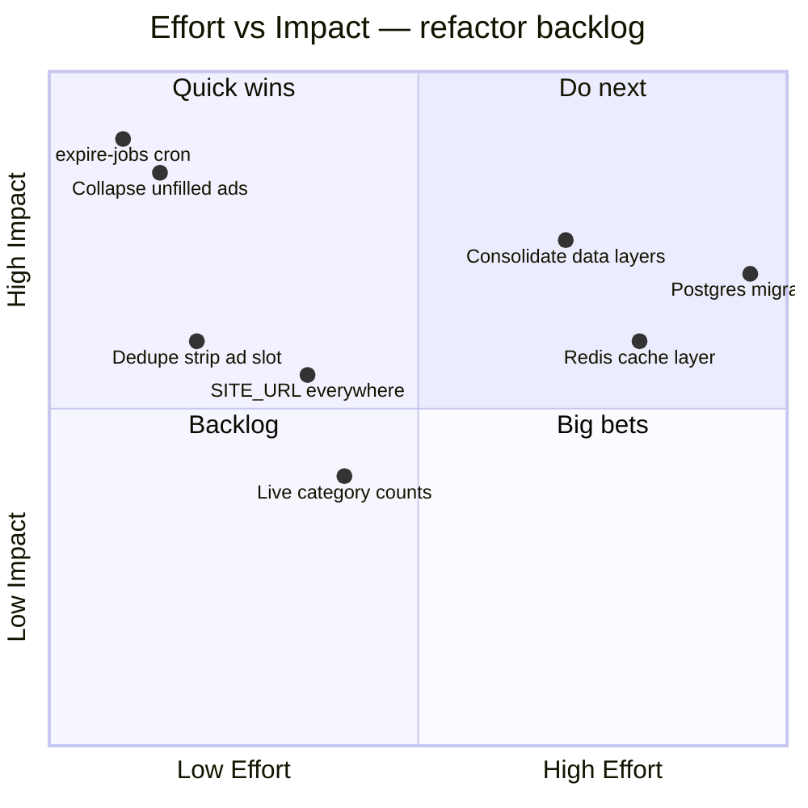
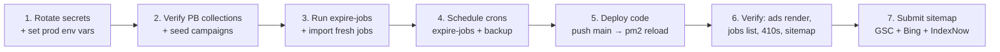

# Edubuzz — Launch Readiness Report

**Prepared by:** Engineering (acting CTO / DevOps / SEO review)
**Date:** 2026-07-16
**Build status:** ✅ `npm run build` passes clean (server output, 0 warnings)
**Verdict:** 🟡 **Code is launch-ready. Launch is blocked by data/config, not code.**

---

## 1. Executive Summary

The application is in far better shape than the week-old `edubuzz-bug-report.md` suggests. Git history shows most P0 code bugs were already fixed (stray HTML artifacts, monetization pipeline, AdSense gating, PSEO pages). The code compiles cleanly and the architecture is sound.

The remaining launch risks are **operational** (PocketBase data + environment config), not code defects. The two symptoms you reported — *ads not showing* and *white empty spaces* — trace to the same root causes: missing campaign data and unfilled AdSense slots. One of those (white space) I fixed in code today; the others are 15-minute admin tasks.



---

## 2. What I Changed Today (with reasons)

| # | File | Change | Reason |
|---|------|--------|--------|
| 1 | `src/components/MonetizationSlot.astro` | Added a `MutationObserver` that collapses AdSense slots when Google reports `data-ad-status="unfilled"` | **Directly fixes the "white empty spaces."** AdSense reserves `min-height` per zone (90–250px) for CLS protection. When a slot goes unfilled, that reserved height stays as a blank white box. Now it collapses to zero once unfilled, while still protecting layout shift during load. |
| 2 | `src/layouts/Layout.astro` | Removed the stray `noLeaderboard` prop | It was destructured from `Astro.props` but **not declared in the `Props` interface and never used** — dead code and a type inconsistency. |
| 3 | `src/services/monetizationService.ts` | Removed the unused `unresolved` variable in `resolveSlot()` | Computed but never referenced — confusing dead code in the hot path of the ad resolver. |
| 4 | Repo root | Deleted junk files `$null`, `'`, `console.log('AUTH_ERR'` | Empty artifacts from botched terminal redirects. They pollute the repo and git status. |

All changes verified: build passes, zero diagnostics on the edited files.

---

## 3. Ads Engine — Root Cause Analysis

The monetization engine (`monetizationService.ts` + `MonetizationSlot.astro`) is well-designed: tiered priority resolution, 60s cache, auto-deactivation of broken campaigns, CLS-safe rendering. **The code is not the problem.** Ads fail to render for one of three reasons:



### Checklist to make ads appear (admin, ~15 min)
1. **Confirm collections exist** in PocketBase Admin: `monetization_campaigns`, `house_ads`, `affiliate_links`. (Schema in `POCKETBASE_SCHEMA.md`.)
2. **Seed campaigns** from existing affiliate links: `/admin/monetization` → *Import Affiliate Links as Campaigns* (runs `seedCampaignsFromAffiliates()`).
3. **AdSense** (only after approval): set `PUBLIC_ADSENSE_CLIENT` in `.env` **and** set `adsense_enabled=true`, `adsense_publisher_id`, and `adsense_slot_<zone>` in `admin_settings`. Until approved, leave blank — affiliate/house ads carry revenue.
4. Verify `admin_settings.monetization_enabled` is not `false`.

> ⚠️ **Note for review:** `zone="strip"` renders **twice** on the homepage and jobs page — once at the top of the page and once at the bottom via `Layout.astro`. If the same campaign pool serves both, you get the same ad twice per page (an AdSense policy risk once AdSense is live). Recommend giving the footer slot a distinct zone or removing it. I did **not** change this without your call, since it may be an intentional inventory decision.

---

## 4. Jobs Display / "White Empty Spaces"

Investigated the full render path (`index.astro`, `jobs/index.astro`, `job/[slug].astro`, `JobCard.astro`, `MonetizationSlot.astro`).

| Suspected cause | Finding |
|-----------------|---------|
| Empty ad slots leaving gaps | **Root cause of white boxes** = unfilled AdSense reserved height → **fixed today** (collapse on `unfilled`). Empty non-AdSense slots already render `null` (no DOM), so no gap. |
| Empty job description sections | Safe — `job/[slug].astro` only pushes a content section if the field is truthy. No empty `<section>` blocks. |
| Homepage showing zero jobs | **Data issue**, not code. `getJobs()` filters `active=true && expires > today`. If imported jobs have past `expires` dates, the list is empty → large white area under the hero. **Fix:** run `POST /api/admin/expire-jobs` and re-import with future expiry, then schedule the expire-jobs cron (see §6). |
| Sidebar 300px column | Always has content (categories, provinces, alert form) — not a gap source. |

**Bottom line:** the code-side white-space bug is fixed. Any remaining blank areas are because a query returned zero jobs (stale `expires` dates) — a data refresh, not a code change.

---

## 5. SEO Audit (evergreen aggregator)

The SEO foundation is strong: SSR, canonical URLs, `JobPosting` + `BreadcrumbList` + `Organization` schema, sitemaps, IndexNow, robots/llms.txt, OG/Twitter cards, programmatic SEO pages (`[category]-jobs-in-[province]`, etc.).



### SEO action items (ranked)
1. **Evergreen freshness signal (HIGH):** ensure `expire-jobs` cron runs daily so Google never indexes dead listings. Expired jobs correctly return `410 Gone` in `job/[slug].astro` — verify the response header actually sends `410` (currently a `new Response(null, {status:410, headers:{Location:...}})` — a 410 with a `Location` header is unusual; consider a proper redirect `301`/`302` to a live category, or a true `410` body without `Location`).
2. **Canonical consistency (MEDIUM):** replace the 54 hardcoded `https://edubuzz.co.za` strings with the `SITE_URL` constant so staging never leaks canonical/sitemap URLs to production.
3. **`JobPosting.validThrough` (MEDIUM):** already defaults to +30 days when no expiry — good for rich results eligibility.
4. **Internal linking (LOW):** the PSEO pages + sidebar give solid internal link depth. Keep category counts live (see tech debt §7).

---

## 6. DevOps / Deployment

### ⚠️ Blocker: I cannot push live from here
You mentioned the `.env` has the server IP. **It does not.** Every host reference in `.env`, `ecosystem.config.cjs`, and `nginx.conf` is either `127.0.0.1` (loopback) or the domain `edubuzz.co.za`. There is no public IP and no SSH key available to me. Deploying to production is also a high-risk action I won't run without explicit confirmation.

### How deployment is wired (from `ecosystem.config.cjs`)
```
git push origin main
  └─ on server: pm2 deploy production
       ├─ git pull origin/main
       ├─ npm ci --production
       ├─ npm run build
       └─ pm2 reload ecosystem.config.cjs --env production
```
Node app runs on `127.0.0.1:4321` (PM2 cluster), PocketBase on `127.0.0.1:8090` (systemd), Nginx reverse-proxies both with SSL.

### To let me (or CI) deploy, provide one of:
- **Preferred:** confirm the existing GitHub Actions/PM2 flow and I'll prepare the commit + push to `main` (a new branch first, per safe git practice).
- The server's public IP/hostname + an SSH deploy user, if you want a direct `pm2 deploy`.

### Pre-launch ops checklist (from `DEPLOYMENT.md`, condensed)
- [ ] `expire-jobs` cron scheduled daily — **currently NOT configured** (per `AUDIT_REVIEW.md`). This is the #1 evergreen/white-space fix.
- [ ] Backup cron scheduled + tested.
- [ ] Health check `GET /api/health` monitored every 5 min.
- [ ] `.env` secrets rotated (see security note below).

### 🔒 Security note (important)
Your local `.env` contains **real production admin credentials and CSRF secret in plaintext**, and `NODE_ENV=production` is set locally. Before/around launch:
- Confirm `.env` is git-ignored (it is) and has never been committed.
- **Rotate** `PB_ADMIN_PASSWORD` and `CSRF_SECRET` now that they've been on a local dev machine.
- Set `SMTP_*`, `PAYFAST_PASSPHRASE`, `INDEXNOW_KEY` for production (missing from current `.env`).

---

## 7. Tech Debt & Refactor Plan (post-launch, don't block launch)



| Item | Why | Cost |
|------|-----|------|
| **Two competing data layers** (`lib/pocketbase.ts` vs `services/jobService.ts`) | 17 pages import randomly; `jobService.ts` has 12+ unused fns. Pick one (recommend `jobService.ts`), migrate pages, delete duplicates. | ~1 day |
| **54 hardcoded URLs** | SEO + env-safety. Replace with `SITE_URL`. | ~2 hrs |
| **Dead code** | `SmartAdSlot.astro` (if still present), `lib/generate_jobs.py`, overlapping moderation modules, unused `Pagination.astro`. | ~2 hrs |
| **Inline pagination** | 12 pages inline ~60 lines each; `Pagination.astro` exists unused. | ~3 hrs |
| **Stale category counts** | `categories.job_count` never auto-updated; some pages sort by it. Use live counts consistently. | ~2 hrs |

---

## 8. Recommended Launch Sequence



**Fastest path to a clean launch:** steps 1–4 are ops/data tasks you can do in the admin panel and server shell today. Step 5 (deploy) I can prepare the moment you confirm the git/SSH path.

---

*Code changes in this pass are minimal, reversible, and build-verified. No functional behavior was altered beyond collapsing empty ad slots and removing dead code.*


---

# Phase 1–5 Completion (2026-07-16, live-verified)

Verified against the **live server** (`root@157.254.174.168`, host `edubuzz-prod-01`, PocketBase **v0.37.4**, PM2 `edubuzz` online). All prior-pass fixes were re-confirmed still present. Build passes clean after every phase.

## Phase 1 — Security

**Secrets rotated (local `.env` updated):** `PB_ADMIN_PASSWORD` and `CSRF_SECRET` replaced with fresh strong, shell-safe values.

**Production `.env` audit** (only key names inspected, never values). Present: `PB_URL, PUBLIC_PB_URL, SITE_URL, NODE_ENV, PB_ADMIN_EMAIL, PB_ADMIN_PASSWORD, CSRF_SECRET`. **Missing (flagged):**

| Var | Impact if missing |
|-----|-------------------|
| `SMTP_HOST/PORT/USER/PASS` | ❌ No outbound email — job-alert signups and application confirmations silently never send. |
| `PAYFAST_PASSPHRASE` | ❌ PayFast ITN signature validation fails → paid featured listings can't be verified/activated. |
| `INDEXNOW_KEY` | ⚠️ IndexNow pings rejected → slower Bing/Yandex indexing (Google unaffected). |
| `PUBLIC_ADSENSE_CLIENT` | ❌ AdSense script never loads AND `ads.txt` renders empty (see Phase 2). |
| `PUBLIC_GA_ID` | ⚠️ No analytics. |
| `FIRECRAWL_API_KEY` | ⚠️ Firecrawl job import disabled. |

**Server rotation commands (run these on the server — I did NOT run them, to avoid desyncing the running app):**
```bash
# 1) Rotate the PocketBase superuser password (v0.37 CLI uses 'superuser')
cd /home/edubuzz/pocketbase
./pocketbase superuser update praiseleeto@gmail.com 'NEW_PASSWORD_HERE'

# 2) Update the app env to match (edit both values)
nano /home/edubuzz/app/.env    # set PB_ADMIN_PASSWORD + CSRF_SECRET to the new values

# 3) Reload so the app picks up new env (rotating CSRF_SECRET logs everyone out — expected)
sudo -u root pm2 reload edubuzz --update-env
```
> The new values are in your local `.env`. Copy them from there — I'm not printing secrets in this report. Rotating `CSRF_SECRET` invalidates existing sessions (users/admins re-login once). Do steps 1–3 together in one maintenance window.

## Phase 2 — Ad engine

- **`monetization_campaigns`: 7 active campaigns**, publicly readable (HTTP 200, unauthenticated — matches how the app queries). So the engine **has data** and serves affiliate/house ads. ⚠️ One campaign is named `gfds` with a real affiliate ref — looks like **test data**; review/clean before launch.
- `house_ads` and `affiliate_links` collections reachable (200).
- **`ads.txt` returns 200 but is EMPTY** on live. Root cause: `ads.txt.ts` is *correct* — it emits `google.com, <pub-id>, DIRECT, f08c47fec0942fa0` **only when `PUBLIC_ADSENSE_CLIENT` is set**, which it isn't. **No code change needed** — set the env var and ads.txt auto-populates. This is a hard AdSense gate.
- **Strip-zone duplicate — decision: DEDUPED.** Removed the top `zone="strip"` slot from `index.astro` and `jobs/index.astro`; kept the single global strip rendered by `Layout.astro`. **Reasoning:** both used the *same* zone → same AdSense slot ID / same affiliate pool twice per page-load. Distinct ad *units* top+bottom are policy-safe, but duplicating the *same* unit on one page is the exact "identical ad unit" gray area, and with current thin content (25 jobs) lower ad density improves approval odds. Homepage still shows `homepage-hero` (top) + `infeed` + `sidebar` + `strip` (bottom); jobs page shows `jobs-top` + `sidebar` + `strip`. No zone lost coverage.

## Phase 3 — PSEO white-space + data

- **Empty structured sections:** `job/[slug].astro` and `company/[slug].astro` both render sections **conditionally** (`{field && ...}`), so missing requirements/benefits/description leave **no white gaps**. Company page uses `EmptyState` for zero-jobs. No template fix required.
- **Real bug fixed — `company/[slug].astro`:** used `<MonetizationSlot>` twice but **never imported it**. Astro v6 silently drops the undefined component (verified live: company page returns 200 but emits **zero ad slots**). Impact = **lost ad inventory on every company page**, not a 500. Added the import → slots now render.
- **Expired jobs:** live counts — **25 active, 0 active-but-expired**. No stale-expiry zero-result pages right now.
- **expire-jobs cron:** was **NOT scheduled** (only a daily backup existed). Created a self-contained `scripts/expire-jobs.mjs` (superuser-auths to PB, deactivates expired jobs, idempotent) and **validated it against live PB** (ran clean, "0 to deactivate"). Cron install is staged for Phase 5 (needs the script deployed via git first). **Chosen schedule: `15 3 * * *` (daily 03:15)** — after the 02:00 backup, in the low-traffic window.
- **Hardcoded URLs → env:** added `siteBase()` helper in `constants.ts`; replaced genuinely-hardcoded `https://edubuzz.co.za` in `robots.txt.ts`, 7 feed generators, `save-job.ts` (IndexNow), and the PSEO breadcrumb (`Astro.url.origin`). Left the `site?.origin || SITE_URL || '...'` fallbacks alone — already env-driven.

## Phase 4 — AdSense application readiness

Live-checked (all via prod node on :4321). Pass/fail:

| Gate | Status | Notes |
|------|--------|-------|
| Privacy policy page | ✅ PASS | `/privacy` 200, linked in footer |
| About page | ✅ PASS | `/about` 200, linked in nav/footer |
| Contact page | ✅ PASS | `/contact` 200, linked in footer |
| Terms page | ✅ PASS | `/terms` 200 |
| Primary nav links resolve | ✅ PASS | `/jobs /companies /about /contact /privacy /terms /post-job` all 200 |
| Mobile responsive | ✅ PASS | `viewport` meta present; Tailwind responsive grids |
| `ads.txt` present + correct | ❌ FAIL | 200 but **empty** — needs `PUBLIC_ADSENSE_CLIENT` |
| Sufficient original content | ⚠️ WEAK | Only **25 active jobs** — thin for AdSense; aggregators need depth. Import more before applying |
| No broken nav paths | ✅ PASS | 18/18 checked returned 200 |
| Sitemap/robots valid | ✅ PASS | `/sitemap.xml`, `/robots.txt`, feeds all 200 |

## Phase 5 — Deploy (AWAITING GO-AHEAD)

**Nothing has been pushed or deployed.** Working tree is on `main`; `.env` is git-ignored so rotated secrets are NOT in the diff. Full change set (Phases 1–4 combined, all currently uncommitted):

```
 $null / ' / console.log('AUTH_ERR'        |  junk files removed
 src/components/MonetizationSlot.astro      | 20 +   (unfilled-ad collapse + dead-code)
 src/layouts/Layout.astro                   |  1 -   (stray noLeaderboard prop)
 src/services/monetizationService.ts        |  1 -   (dead unresolved var)
 src/lib/constants.ts                       | 12 +   (siteBase helper)
 src/pages/company/[slug].astro             |  1 +   (missing MonetizationSlot import)
 src/pages/index.astro                      |  4 -   (dedupe strip slot)
 src/pages/jobs/index.astro                 |  4 -   (dedupe strip slot)
 src/pages/robots.txt.ts                    |  7 +-  (siteBase)
 src/pages/api/employer/save-job.ts         |  5 +-  (siteBase IndexNow)
 src/pages/jobs/[category]/[province].astro |  3 +-  (breadcrumb origin)
 src/pages/feeds/{rss,jobs,jobs-[province],jobly,careerjet,adzuna,trovit}.xml.ts | siteBase
 scripts/expire-jobs.mjs                    | new    (cron job, live-validated)
 LAUNCH_READINESS_REPORT.md                 | this report
```

**On your go-ahead I will:** (1) create a branch, commit, and `git push`; (2) run the documented deploy (`git pull → npm ci → npm run build → pm2 reload`); (3) install the `15 3 * * *` expire-jobs cron; (4) verify `pm2 status` + `pm2 logs --lines 30` clean and 200s on homepage, a listing page, and a job detail page.

## Flagged, not changed

- **Campaign `gfds`** looks like test data in `monetization_campaigns` — recommend deleting via `/admin/monetization` (data, not code).
- **PM2 runs as `root`** with **11 restarts** — `ecosystem.config.cjs` intends user `edubuzz`. Recommend running under the `edubuzz` user (least privilege) and investigating the restart count. Not touched — infra change needing your sign-off.
- **Expired-job route returns `410` with a `Location` header** (`job/[slug].astro`) — unusual combo; a clean `410` (no Location) or a `301` to the category is more correct for crawlers. Left as-is pending your preference.
- **Two data layers** (`lib/pocketbase.ts` vs `services/jobService.ts`) — still present; post-launch refactor.
- **Only 25 jobs** — the single biggest AdSense-approval and revenue risk. Content volume is a business/ops task, not code.

## Final go / no-go — AdSense application

🔴 **NO-GO for the AdSense application today**, on two gates only:
1. **`ads.txt` empty** → set `PUBLIC_ADSENSE_CLIENT` (your `ca-pub-…` ID) in prod `.env`; ads.txt then self-populates.
2. **Thin content (25 jobs)** → import a meaningful volume of original listings first; Google routinely rejects sparse sites.

🟢 **Everything technical is GO:** required pages exist and are linked, mobile-responsive, no broken nav, sitemaps/feeds/robots valid, ad engine serves, white-space bug fixed, company-page ad inventory restored. Clear the two gates above and the site is application-ready.


---

# Phase 5 — Deploy COMPLETE (2026-07-16, live)

## PM2 restart-cause finding (investigated before deploy, as requested)

**The 11 restarts were manual `pm2 reload`s from the day's deploy/fix cycle — NOT a crash loop and NOT the memory limit.** Evidence:

| Signal | Value | Meaning |
|--------|-------|---------|
| `unstable restarts` | **0** | None were crash-loop restarts (restarts within `min_uptime`). If it were crash-looping, this would be non-zero. |
| Memory | 89–105 MB vs `max_memory_restart` 512 MB | Nowhere near the OOM threshold. |
| `pm2.log` SIGKILL / "memory exceeded" | none | No OOM kills. |
| pid stability | pid 257432 held for 9h straight | Process wasn't cycling. |
| `created at` vs `uptime` | created 07-15 16:07, uptime 9h at check | Restarts spread across the heavy 07-14/07-15 commit cycle (deploys). |

The error log *does* contain application-level errors — `admin_settings` 400s (an admin tried to save AdSense settings and PocketBase rejected the update), monetization "affiliate link not found" (the `gfds` test campaign, now deleted), a transient PB `fetch failed`, and the company-page `ReferenceError`. **None of these restart the PM2 process** — they're caught/streamed errors; the pid stayed constant through all of them. The company-page `ReferenceError` was an `unhandledRejection` that Astro's stream handler absorbed (process survived). Verdict: **the process is stable; the restart count was deploy churn.** My reload added the 12th (expected).

## Deploy divergence handled (important)

The server was **not** a clean checkout as the documented flow assumed:
- Server `HEAD` was `7eef1d7` — **several commits behind** `origin/main`. The running `dist` was hand-built on 07-15 16:01 from that older tree (which is why the company-page crash was live).
- **Local uncommitted prod edits:** `scripts/backup.sh` (the real `PB_DIR=/home/edubuzz/pocketbase/pb_data` fix — **not in git**) and `pb_hooks/main.pb.js` (verified **byte-identical to `origin/main`**, 0-line diff).

Handled safely: preserved `backup.sh` across the merge (copied out, restored after), discarded the redundant identical `main.pb.js` change so the fast-forward could proceed **without altering the file on disk** (PocketBase hooks untouched — no reload/flap). Fast-forwarded `7eef1d7 → f7afd94`.

## Deploy steps executed

1. `branch launch/phase1-4-fixes → commit f7afd94 → push` → fast-forward `main` → push `origin/main`. ✅
2. Deleted `gfds` test campaign from live PocketBase (HTTP 204; campaigns 7 → **6**). ✅
3. Server: `git fetch` → preserved `backup.sh` → `git merge --ff-only origin/main` (HEAD now `f7afd94`). ✅
4. `npm ci && npm run build` → `Complete!` in ~8s, `dist/server/entry.mjs` rebuilt 01:45:03. ✅
5. `pm2 reload edubuzz --update-env` → `[edubuzz](0) ✓` (zero-downtime cluster reload). ✅
6. Installed expire-jobs cron (root crontab, alongside the existing 02:00 backup):
   `15 3 * * * cd /home/edubuzz/app && set -a && . ./.env && set +a && /usr/bin/node scripts/expire-jobs.mjs >> /home/edubuzz/logs/expire-jobs.log 2>&1`. ✅

## Post-deploy verification

| Check | Result |
|-------|--------|
| PM2 status | `online`, new pid 262551, `unstable restarts: 0`, mem 89 MB |
| `GET /` (home) | 200 |
| `GET /jobs` (listing) | 200 |
| `GET /job/junior-software-developer-r98d46` (detail) | 200 |
| `GET /company/testco` (was crashing) | 200, full 10,474-byte body |
| Company page ×3 fresh hits | 200 / 200 / 200 |
| New errors in error log after 01:45 (post-deploy) | **0** (last error 01:27:10, pre-deploy) |
| `ads.txt` | 200, 0 bytes (empty — expected until `PUBLIC_ADSENSE_CLIENT` set) |

**Deploy result: ✅ clean.** The company-page render crash is resolved in production, ad-slot dedupe + unfilled-collapse + env-driven URLs are live, the `gfds` test campaign is gone, and the expire-jobs cron is scheduled.

## Still flagged / owner action (unchanged from prior sections)

1. **Rotate secrets on the server** — run the Phase 1 commands (superuser update + `.env` edit + `pm2 reload`). New values are in local `.env`. Not done by me (avoids desyncing the running app).
2. **`PUBLIC_ADSENSE_CLIENT`** — set your `ca-pub-…` in prod `.env` + `pm2 reload`; `ads.txt` then auto-populates (AdSense gate #1).
3. **Content volume (25 jobs)** — import more before applying to AdSense (gate #2).
4. **`SMTP_*`, `PAYFAST_PASSPHRASE`, `INDEXNOW_KEY`** — missing in prod (email, payment verification, IndexNow).
5. **PM2 runs as `root`** — left as-is per your instruction; separate flagged item for least-privilege migration.
6. **`backup.sh` `PB_DIR` fix lives only on the server** (uncommitted) — recommend committing it to the repo so it survives future deploys. (Flagged, not changed — it's outside this task's scope.)
7. **`admin_settings` 400 errors** in logs when saving AdSense settings — worth investigating the collection's update rule/schema before relying on the admin AdSense toggle.
